# Basic Topology

## Finite, Countable and uncountable

## Exercise
##### pdf file

**For pdf file** 

- [Part 1](pdf_docs/Rudin Ch2.1.pdf)
- [Part 2](pdf_docs/Rudin Ch2.2.pdf)

##### Images

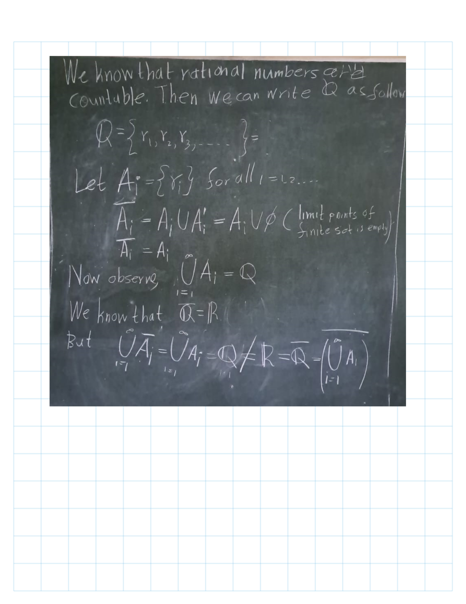
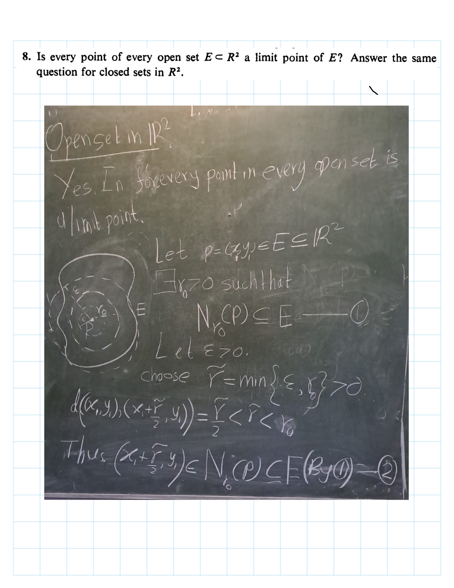
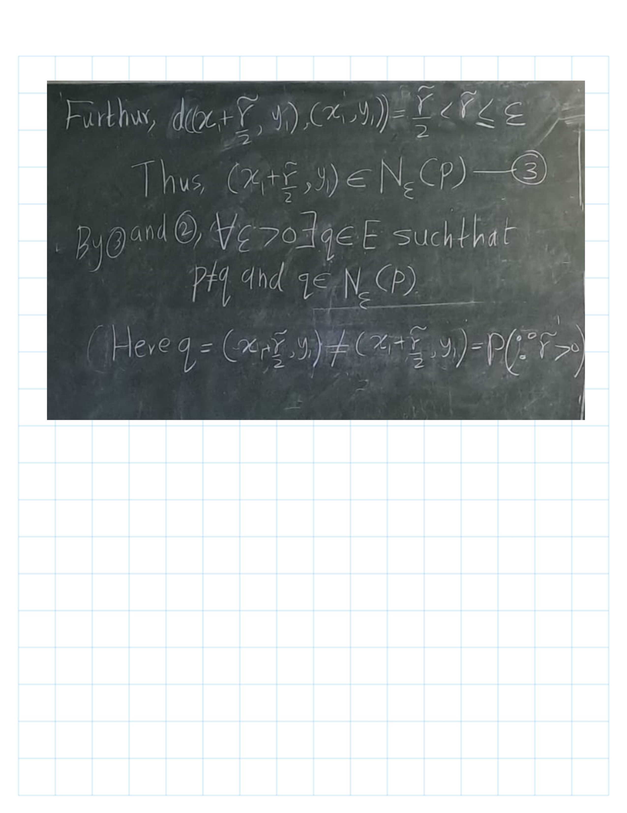
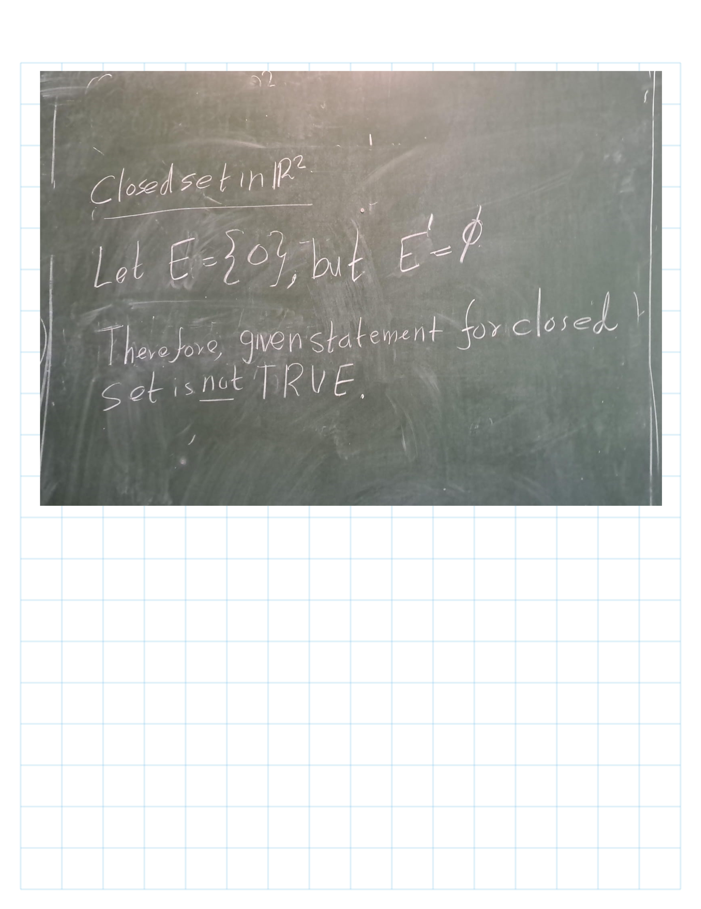

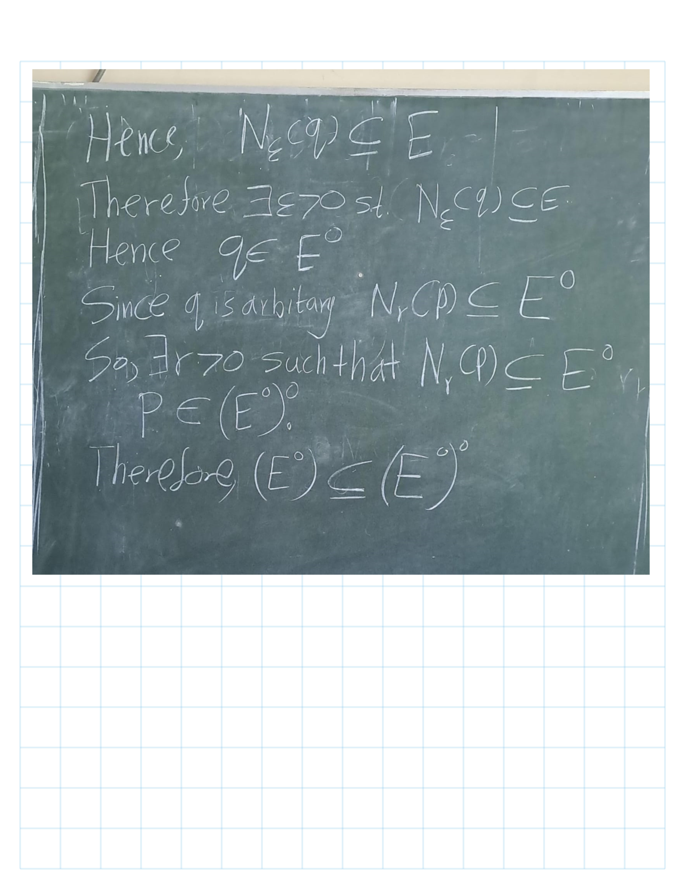
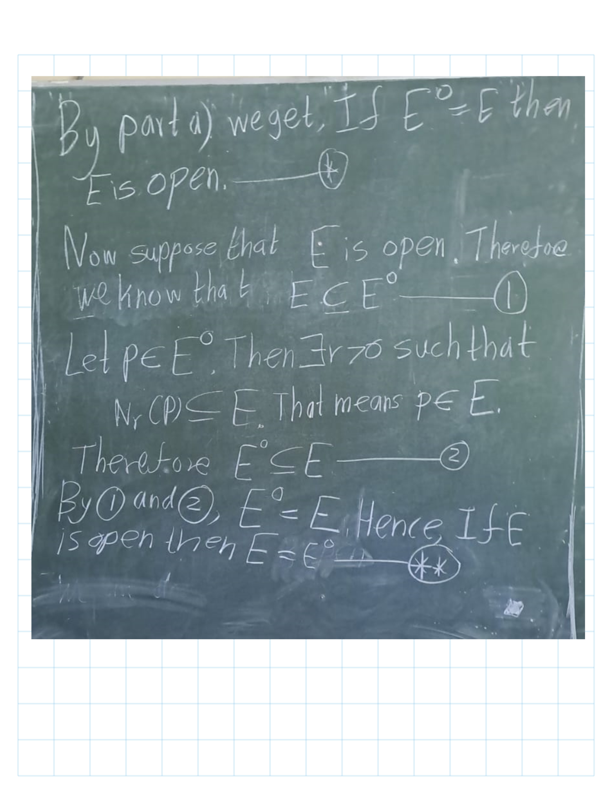

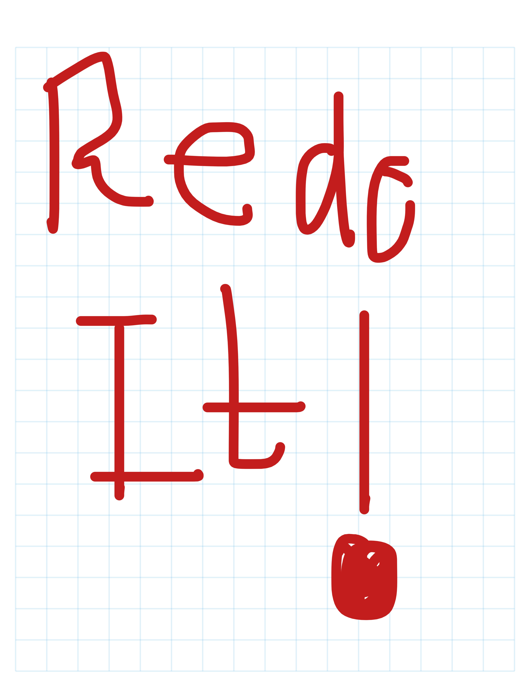
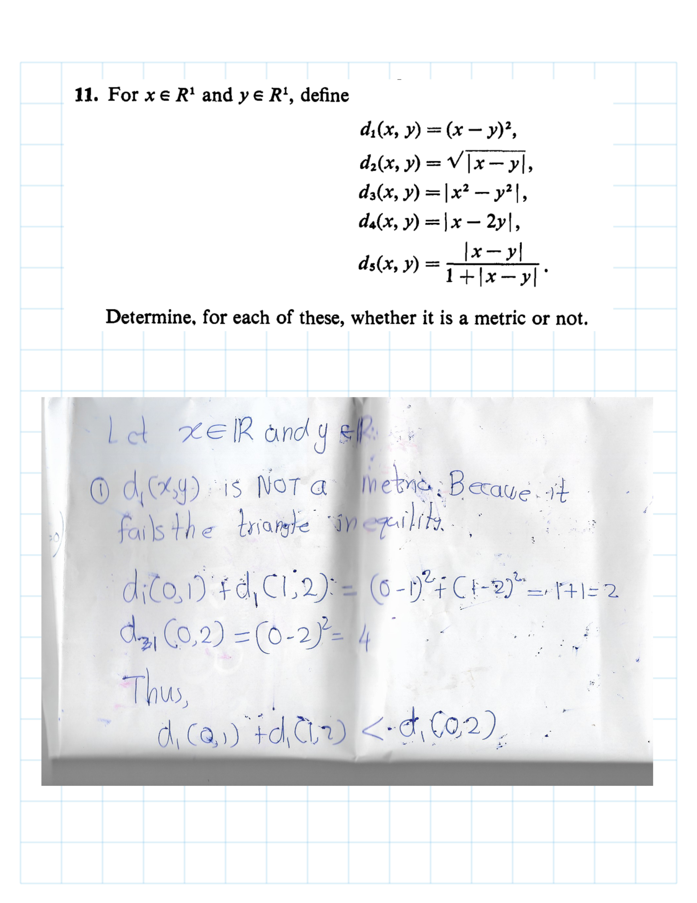
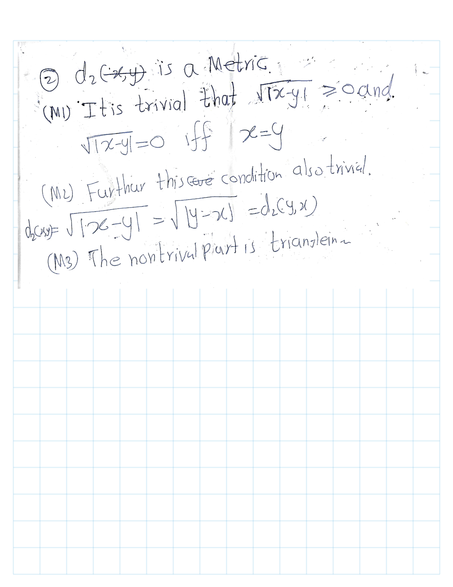

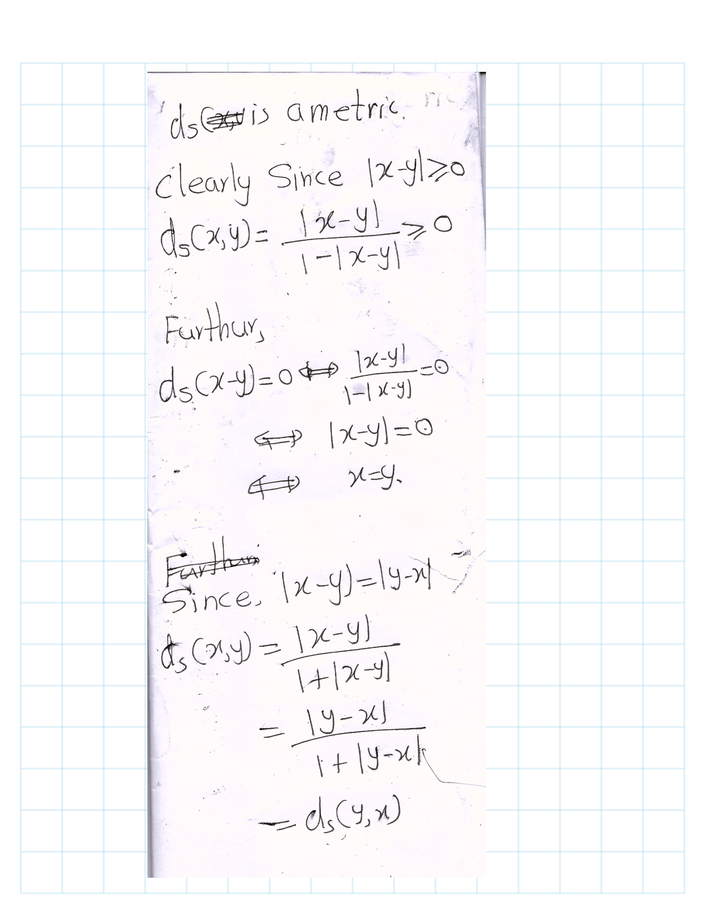

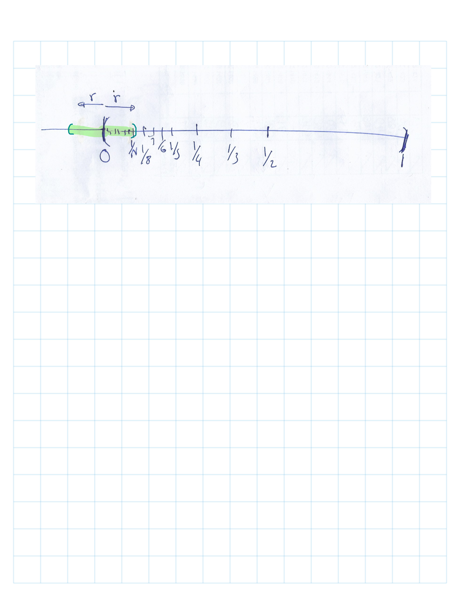

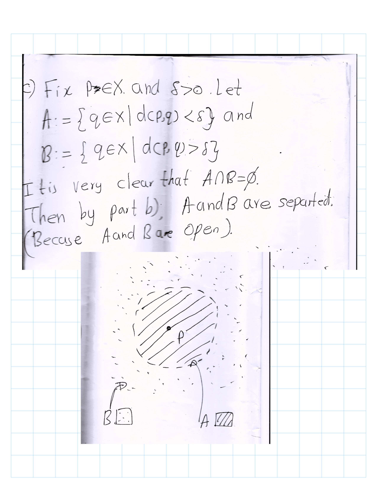
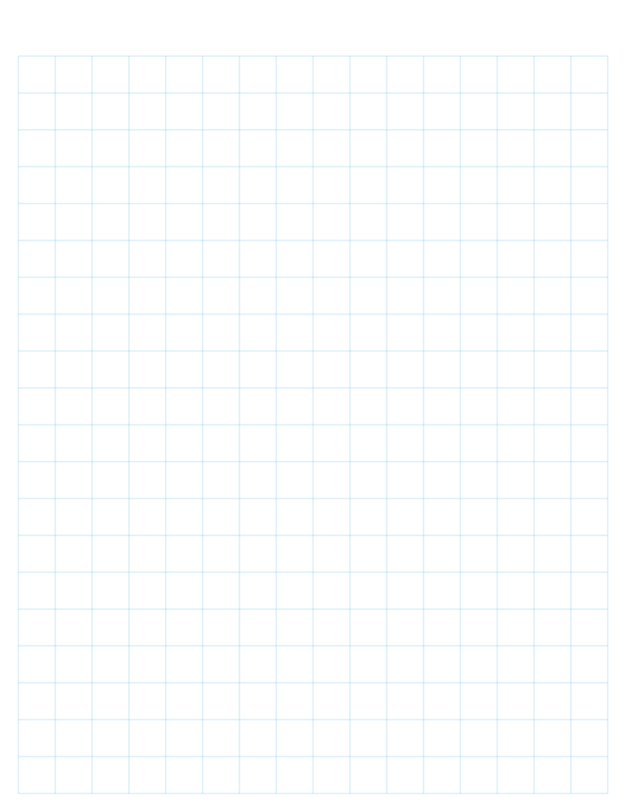

